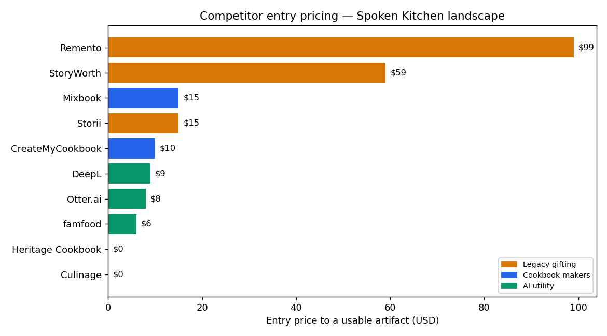
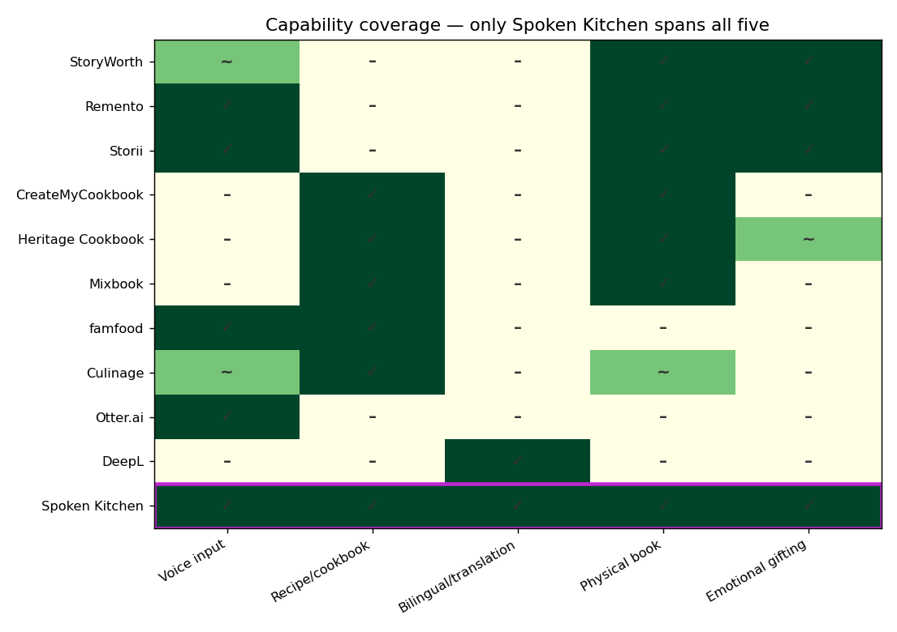
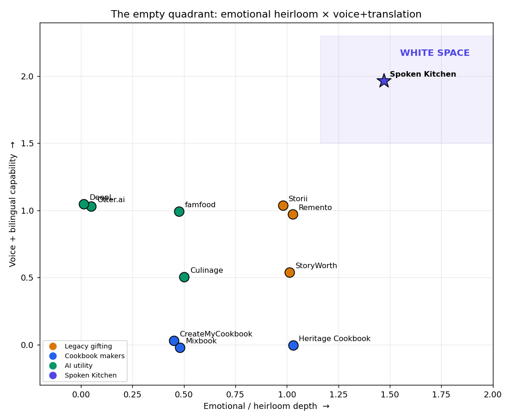

# I did a week of market research in an afternoon — with Nimble and a terminal

*How I used live web data to find the white space for Spoken Kitchen, an AI bilingual
heirloom-recipe book for immigrant families.*

---

## The hook: a recipe nobody wrote down

My grandmother cooks from memory. No measurements, no cards — just her hands and a running
commentary half in Korean, half in English. I started building **Spoken Kitchen** to
capture that: record an elderly relative cooking, transcribe it, translate it, and turn it
into a bilingual recipe book the rest of the family can actually cook from.

Then came the uncomfortable founder question: *am I the only one who needs this?* If there's
a StoryWorth-for-recipes-with-translation already, I should know on day one — not after I
build it.

The honest way to answer that is a week of market research: competitors, pricing,
positioning, who the customer is, where the gaps are. I did it in an afternoon, entirely
from the terminal, using [Nimble](https://nimbleway.com). Here's the exact path — every
command, the real output, and what each phase decided.

> **What's reproducible here:** every phase is a shell script in `scripts/NN-*.sh` that
> calls the `nimble` CLI and writes raw JSON to `data/raw/`. Two Python scripts turn the
> data into the charts below. You can re-run the whole thing.

---

## Setup (about 10 minutes)

```bash
npm i -g @nimble-way/nimble-cli
export NIMBLE_API_KEY="your_key"          # from online.nimbleway.com/settings/api-keys
nimble search --query "StoryWorth pricing" --max-results 3 --search-depth lite
```

JSON back = you're live.

> **One gotcha worth saving you:** the CLI reads `NIMBLE_API_KEY` from the *environment*,
> not a `.env` file. If you keep the key in `.env`, load it first: `set -a; . ./.env; set +a`.
> And on a standard account, `--search-depth fast` and `--include-answer` are
> enterprise-only (they 403) — `lite` and `deep` cover everything below.

The whole method is one mapping: **a business question → a Nimble capability.** That mapping
*is* the research.

| Phase | Business question | Nimble capability |
|---|---|---|
| 1 | Who are all the players? | `nimble search` discovery sweeps |
| 2 | What do they charge, and how? | `nimble extract` pricing pages + search |
| 3 | How do they position? | `nimble extract` homepages + demand search |
| 4 | Who's the customer, where are they? | `nimble search` voice-of-customer + communities |
| 5 | Where's the gap? | cross-analysis → two charts |

---

## Phase 1 — Landscape: who's already here?

Spoken Kitchen sits between three markets, so I swept all three plus an **intersection
probe** — a search for the *exact* use case. If a direct competitor exists, it surfaces there.

```bash
nimble search --query "StoryWorth alternatives family memoir gift service" \
  --search-depth deep --max-results 10 --format json > data/raw/01-legacy-alternatives.json
# ...and 6 more (see scripts/01-landscape.sh), including:
nimble search --query "AI bilingual heirloom recipe book from elderly relative voice immigrant family" \
  --search-depth deep --max-results 10 --format json > data/raw/01-intersection.json
```

What came back:

- **Legacy gifting:** StoryWorth, Remento, Storii — crowded, subscription-led, text-prompt
  dominant. Remento is the only one leaning on *voice*.
- **Cookbook makers:** CreateMyCookbook, Heritage Cookbook, Mixbook — mature, print-led,
  manual data entry.
- **AI utility:** Otter, DeepL, Notta… plus two the shortlist *missed* — **famfood** and
  **culinage**, both doing voice→recipe. Nimble surfacing competitors I didn't know to look
  for is exactly the point.
- **The intersection probe returned nothing direct** — only editorial features and a recipe-card
  digitizer. White space, visible at the discovery stage.

**Decision:** keep going — the gap is real enough to size.

---

## Phase 2 — Pricing: what's the market willing to pay?

I scraped pricing pages directly. `nimble extract` returns the page as markdown:

```bash
nimble extract --url "https://welcome.storyworth.com/storyworth-pricing" \
  --format markdown -r > data/raw/02-storyworth-pricing.md
```

> Real lesson from the run: `extract`'s `--format` is the *content* format
> (`markdown`/`html`), not output. Where prices were rendered in JS (Remento, Mixbook), I
> fell back to `nimble search` and read them out of the snippets.

Normalizing everything (`scripts/analysis/pricing_matrix.py`) gave three models:

- **Annual subscription, book included** — StoryWorth ($59–199/yr), Remento ($99/yr).
- **One-time per-book print** — CreateMyCookbook ($10–20), Mixbook ($15–57).
- **Freemium / SaaS utility** — famfood ($49/yr), Otter ($8–30/mo), DeepL ($9–69/mo).



**Decision:** the gifting ceiling is anchored at **$99–199, one payment, book included** —
buyers already accept it. That's the slot; the bilingual+voice work justifies holding price
above the $10 cookbook floor.

---

## Phase 3 — Positioning: what do they say, vs. what buyers want?

I pulled competitor homepages and compared their copy to how *buyers* actually phrase the
need.

```bash
nimble extract --url "https://www.remento.co/" --format markdown -r > data/raw/03-remento-home.md
nimble search --query "translate family recipes another language keep heritage" \
  --search-depth lite --max-results 8 --format json > data/raw/03-seo-immig.json
```

The messaging splits cleanly:

- **StoryWorth:** *"Help Dad see his life in a whole new light"* — gift occasion, English.
- **Remento:** *"his voice, forever at your fingertips"* — owns **voice**, but for *general
  life stories*, not recipes, not translation.
- **Heritage Cookbook:** has "heritage" in the *name* only; the product is manual typing.
- **Cookbook makers:** pure utility — "make your own cookbook, easy."

And the buyer-side signal that changed everything: **people are already translating family
recipes by hand** — *"I used free AI to translate a 1905 cookbook,"* *"copy and paste the
recipe into the translator."* The need is **validated but unproductized**.

**Decision:** wedge = *"Your grandmother's recipes — in her voice, in both your languages,
in a book you'll cook from."* Counter-position to Remento: *they save his stories; we save
her kitchen, and translate it so your kids can cook it too.*

---

## Phase 4 — ICP: who buys, and where do they live online?

```bash
nimble search --query "reddit preserve grandmother handwritten recipes before she passes" \
  --search-depth deep --max-results 8 --format json > data/raw/04-voc-recipes.json
```

The voice of customer was almost too on-the-nose:

> *"My grandmother passed away last month at 96. While cleaning out her house, nobody had
> her recipes…"*

The **buyer is the adult child (30–50); the subject is the aging parent.** Same emotional
trigger as the proven legacy-gifting market — but pointed at the kitchen. The segment:
**~20M adult second-generation Americans** (Pew), already congregating in Reddit threads,
Facebook recipe-preservation groups, and heritage-language communities.

**Decision:** beachhead persona = *"The Bridge Daughter."* Go-to-market is **community-led**,
not paid search against Mixbook.

---

## Phase 5 — The gap, as a picture

Scoring all 11 players on the five capabilities that define the use case
(`scripts/analysis/gap_map.py`):



One column is empty for everyone but a raw translation utility: **bilingual/translation**.
No product combines it with the heirloom-recipe use case. On the positioning map, the
emotional-heirloom × voice+bilingual quadrant is literally empty except for one star:



**Three crowded markets, one empty intersection — and the empty cell is the translation
column.**

---

## The payoff: what the research decided

| Decision | Call |
|---|---|
| Product wedge | Voice → bilingual → cookable heirloom book |
| Pricing | Annual subscription, **book included, $99–199** |
| Positioning | "Her recipes, in her voice, in both your languages" |
| ICP beachhead | 2nd-gen "Bridge Daughter," aging immigrant parent |
| Channel | Community-led (Reddit / FB heritage & recipe groups) |
| Watch list | famfood, Culinage — closest movers, but neither is bilingual |

## Reflection: what Nimble made trivial

The thing that used to take an analyst a week — sweep a market, scrape pricing, read
positioning, find the customer, name the gap — collapsed into a folder of shell scripts and
two charts. Three properties made the difference:

1. **It's the web, live.** Pricing and Father's-Day homepage copy were current to the day,
   not a stale training snapshot.
2. **It composes.** `search` to discover, `extract` to go deep, piped into the same JSON my
   analysis already spoke. No glue code, no per-site scrapers.
3. **It surfaced unknowns.** famfood and culinage weren't on my list. The tool widened the
   search space instead of just confirming my priors — the most valuable thing research can do.

I came in asking *"am I the only one who needs this?"* I left with a priced, positioned,
customer-named go-to-market — and a heatmap with one empty column that says: *no, you're not
the only one. You're just the first one to build it.*

---

*Reproduce it: clone the repo, set `NIMBLE_API_KEY`, run `scripts/01-landscape.sh` through
`scripts/04-icp.sh`, then the two analysis scripts in `scripts/analysis/`. Raw data lands in
`data/raw/`, findings in `research/`, charts in `assets/`.*
